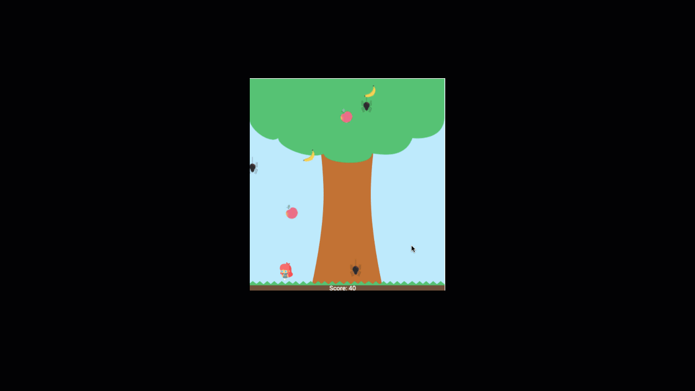

# Grab Fruits!

## About the Project

This project revolves around creating a platform game using the Phaser library, serving as the JavaScript capstone project at Microverse.

### Key Tasks Accomplished:

- Crafted a comprehensive [Game Design Document(GDD)](./game-design-document.md) outlining the game's overview and specific mechanics.
- Developed the platform game utilizing the [Phaser library](https://phaser.io/phaser3).
- Implemented a scoring system utilizing an API to save scores with associated usernames, displaying them within the game view.
- Deployed the game onto a server, ensuring accessibility to all users.

### Additional Features:

Three distinct modes (Easy, Normal, and Hard) with varying enemy and fruit speed settings.
Introduced the ability for the main character to execute a double jump.

A list of commonly used resources that I find helpful is listed in the acknowledgments.

## Table of Contents

- [About the Project](#about-the-project)
- [Built With](#built-with)
- [Live Demo](#live-demo)
- [Game Design Document(GDD)](#game-design-document)
- [Getting Started](#getting-started)
- [How to run the game](#how-to-run-the-game)
- [What is Grab Fruits](#what-is-grab-fruits)
- [How to play the game](#how-to-play-the-game)
- [Rule of the game](#rule-of-the-game)
- [Author](#author)
- [Contributing](#contributing)
- [Show your support](#show-your-support)
- [License](#license)
- [Acknowledgements](#acknowledgements)

## Built With

- [HTML5](https://en.wikipedia.org/wiki/HTML5)
- [CSS](https://en.wikipedia.org/wiki/CSS)
- [JavaScript](https://en.wikipedia.org/wiki/JavaScript)
- [Phaser 3](https://phaser.io/phaser3)
- [Webpack 5](https://webpack.js.org/)
- [Babel](https://babeljs.io/)

## Live Demo

[Live Demo Link](https://grab-fruits-yocosaka.netlify.app)

## Game Design Document

[Game Design Document (GDD) Link](./game-design-document.md)

## Getting Started

To get a local copy up and running follow these simple example steps.

1. On the project GitHub page, navigate to the main page of the repository.
2. Under the repository name, locate and click on a green button named `Code`.
3. Copy the project URL as displayed.
4. If you're running the Windows Operating System, open your command prompt. On Linux, Open your terminal.
5. Change the current working directory to the location where you want the cloned directory to be made. Leave as it is if the current location is where you want the project to be.
6. Type git clone, and then paste the URL you copied in Step 3.  
   e.g. $ git clone https://github.com/yourUsername/yourProjectName
7. Press Enter. Your local copy will be created.
8. To run the test, run `npm test`

## How to run the game

1. After cloning or downloading this repository, in the terminal, move to this folder
   eg: `cd Desktop/platform-game`
2. Run `npm install` or `yarn install`
3. After installing packages in step2, run `npm run build`
4. Run `npm run dev`, then the local server will be automatically opened
5. Choose dist folder, and start the game

## What is Grab Fruits

Grab Fruits! is a simple game as its name is.
A player is expected to collect as many fruits as possible without touching spiders.

## How to play the game

1. Click the "Click to Start" button
2. Input a username that will be shown if a player will be a top 5 scorer.
3. Choose the mode from easy, normal, or hard that is different on the speed of showing spiders(enemy) and fruits
4. Start the game
5. In the game-over view,

- To see the top 5 scorers, click the "Score" button.
- To start the different username or mode, click the "TOP" button
- To restart the game in the same mode, click the "Restart" button

6. In the score view,

- The top 5 scorers are showing with their username and their score
- To start the different username or mode, click the "TOP" button
- To restart the game in the same mode, click the "Restart" button

## Rule of the game

- A player gets a **70** scores when touching a fruit
- The game will be over when a player touches a spider
- A player can be operated by using keyboard cursors arrows (&larr;, &rarr;, &uarr;).
- To run to the left, click **&larr;**, to the right, click **&rarr;**, and to jump up, click **&uarr;**
- A player can double jump, to do it, click **&uarr; again** in the air

## Author

👤 **Yoko Saka**

- GitHub: [@yocosaka](https://github.com/yocosaka)
- Twitter: [@yocosaka](https://twitter.com/yocosaka)
- LinkedIn: [Yoko Saka](https://www.linkedin.com/in/yokosaka)

## Contributing

Contributions, issues, and feature requests are welcome!
Feel free to check the [issues page](../../issues).

1. Fork the Project
2. Create your Feature Branch (`git checkout -b feature/AmazingFeature`)
3. Commit your Changes (`git commit -m 'Add some AmazingFeature'`)
4. Push to the Branch (`git push origin feature/AmazingFeature`)
5. Open a Pull Request

## Show your support

Give a ⭐️ if you like this project!

## License

This project is [MIT](./LICENSE) licensed.

## Acknowledgements

- [Phaser3](https://phaser.io/phaser3)
- [axios](https://github.com/axios/axios)
- [Illustration by Icons 8](https://icons8.com/)
- [Game Art 2D](https://www.gameart2d.com/freebies.html)
- [Mixkit](https://mixkit.co/free-sound-effects/game/)
- [YouTube Auduo Library](https://mixkit.co/free-sound-effects/game/)
- [Freepik](https://www.freepik.com/)
