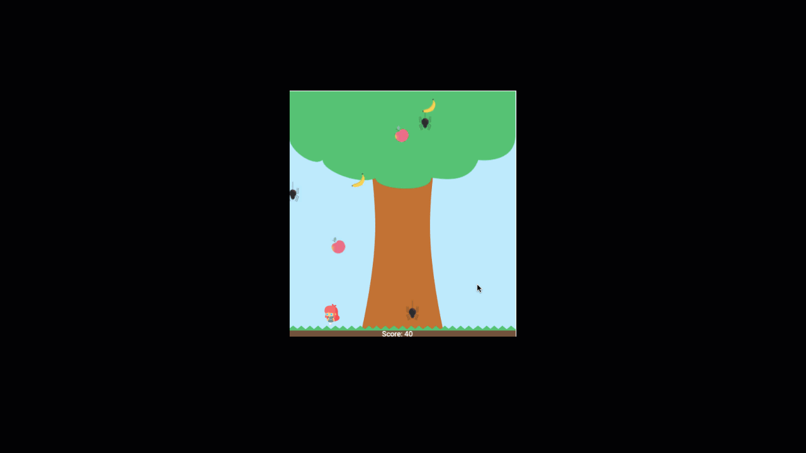

# 🍓 Grab Fruits! – UX-Driven Browser Game

A fast-paced, fruit-grabbing platformer designed and built solo in 3 days — focused on intuitive interaction, minimal distraction, and lightweight challenge.

---

## 🎮 About the Project

**Grab Fruits!** is a self-initiated browser game created as a capstone project at Microverse, using **Phaser 3** and vanilla JS.  
It was my first experiment in game UX, built to explore how simple mechanics and visual feedback can drive engagement and learning flow.

### 🧠 UX Highlights

- Created a [Game Design Document (GDD)](./game-design-document.md) before development to clarify user flow and logic
- Designed with a **"learn-by-doing" flow** — no tutorial needed, learning unfolds through action
- Built 3 difficulty modes with **distinct speed curves** to support player self-regulation
- Implemented **double-jump mechanic** to enhance mobility and surprise
- Clean visuals + minimal UI to reduce cognitive load and focus attention on gameplay

This project demonstrates how I apply **UX thinking to code** — making intuitive feedback loops, progressive challenge, and frictionless interaction part of the gameplay structure.

---

## 🚀 Key Features

- 🍇 Collect fruits and dodge spiders in a classic platformer loop
- 🧠 Choose difficulty: Easy / Normal / Hard (affects speed & patterns)
- 🕹 Keyboard controls with double jump mechanic
- 🏆 Score system integrated with API to save & display top 5 players
- 📱 Deployed & playable in browser (fully responsive)

🔗 [Live Demo](https://grab-fruits-yocosaka.netlify.app)  
🔗 [Game Design Document (GDD)](./game-design-document.md)

---

## 🛠️ Built With

- [HTML5](https://en.wikipedia.org/wiki/HTML5)
- [CSS](https://en.wikipedia.org/wiki/CSS)
- [JavaScript](https://en.wikipedia.org/wiki/JavaScript)
- [Phaser 3](https://phaser.io/phaser3)
- [Webpack 5](https://webpack.js.org/)
- [Babel](https://babeljs.io/)

---

## 👤 Author

**Yoko Saka**  
Frontend Developer × UX Thinker

- GitHub: [yoko-vicky](https://github.com/yoko-vicky)
- LinkedIn: [Yoko Saka](https://www.linkedin.com/in/yoko-vicky/)
- Portfolio: [View Portfolio](https://abiding-snap-e4c.notion.site/Yoko-UX-Informed-Frontend-Development-Structuring-Portfolio-1cb994322fd580deab65d69fbfa3ddba)

---

## 🤝 Contributing

1. Fork the project  
2. Create your feature branch (`git checkout -b feature/AmazingFeature`)  
3. Commit your changes (`git commit -m 'Add some AmazingFeature'`)  
4. Push to the branch (`git push origin feature/AmazingFeature`)  
5. Open a Pull Request

---

## ⭐️ Support

Give a ⭐️ if this inspired you!

---

## 📝 License

This project is [MIT](./LICENSE) licensed.

---

## 🙏 Acknowledgements

- [Phaser3](https://phaser.io/phaser3)
- [axios](https://github.com/axios/axios)
- [Icons8](https://icons8.com/)
- [Game Art 2D](https://www.gameart2d.com/freebies.html)
- [Mixkit](https://mixkit.co/free-sound-effects/game/)
- [YouTube Audio Library](https://www.youtube.com/audiolibrary)
- [Freepik](https://www.freepik.com/)
