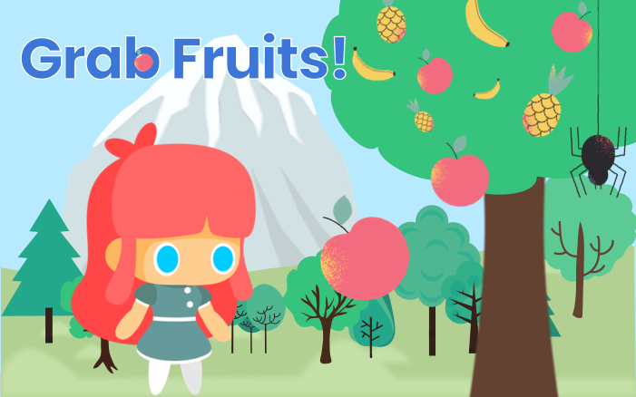

**🎮️ Name of the game:  Grab Fruits!\
👥 Stakeholders:**

* Dev: [Yoko Saka](https://github.com/yocosaka)
* Design: [Yoko Saka](https://github.com/yocosaka)
* QA:[Yoko Saka](https://github.com/yocosaka)

# Overview

## 📐 Project scope

* **Timeline: Needs to built within 5 working days from the request**
* **Budget: None**

## 🗣️ Elevator Pitch

This is a simple game. A player is expected to collect as many fruits as possible without touching spiders.

## 💵 Monetization

I create this game only to learn how to build a web application with JavaScript and Phaser 3. Monetization is not under concern for now.

# Story

The main character lives in a small town. In this town, there is a big mountain and a big tree. She loves taking fruits that are fallen down from the biggest tree in this town.

# Gameplay

In this game, she takes apples, bananas, and pineapple that falls from the tree. Sometimes, spiders fall along with fruits. She hates spiders, so a player needs to avoid touching spiders. If a player touches a spider, the game will be over.

# Core Game Mechanic

## #1 Build platform game with Phaser3 Library

In this project, the developer implements Phaser 3 Library to build the platform game

## #2 Apply actions like running, jumping to the main character

The main character is able to run, jump and double jump in the field

## #3 Scoring system using API

Collect username and set it with their scores to the API.
Show the top 5 scorers' name and their scores in the score view.

# Game elements

## 👤 Characters

* A girl (the main character)
* Spiders (enemy)

## 🏆️ missions & scores

* The mission is to grab as many fruits as possible without touching a spider
* If the main character touches a fruit,  a player will get 70 points for a fruit
* In this score view, the top 5 scorers show
* A player can choose the easy, normal, or hard mode that has different speed of showing enemies and fruits

## 📦️ Objects

* Fruits: apples, bananas, pineapples
* A big tree with some fruits
* Platforms: there are several small blocks that the main character can jump on
* Background images: In the background, there are green grasses, trees, and a mountain. Parallax design is applied to them.

# Assets

## 🎨 Art

* Illustrations for the main character, spiders, fruits: use free stock illustrations
* Background images: some of them are used free stock materials, and others are created by the designer 

## 🔊 Sound

* Click sounds, back music:  use free stock materials

## 🏃‍ Animation

* The main character: apply animations for its idle, run, and jump
