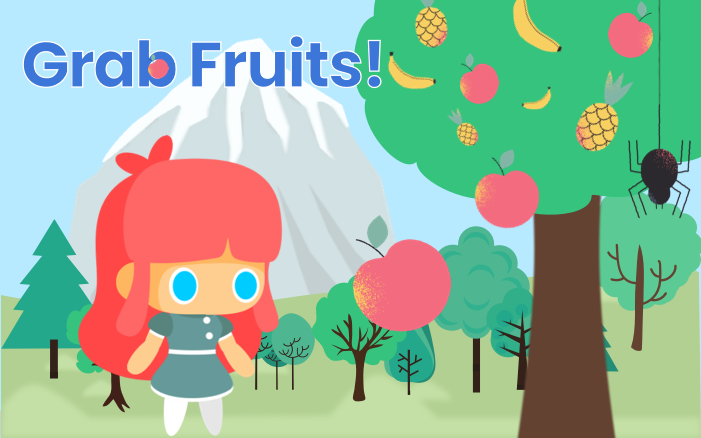

# 🍓 Grab Fruits! – Game Design Document (GDD)

**🎮 Game Name:** Grab Fruits!  
**👤 Role:** Designed, developed, and tested solo by [Yoko Saka](https://github.com/yocosaka)  
**🧠 Focus:** UX-driven game flow, intuitive feedback, and playful micro-interactions

---

## 🗺 Overview

### 📐 Project Scope
- **Timeline:** Delivered in 3 working days (target: 5)
- **Budget:** None — self-initiated for learning purposes

### 🗣️ Elevator Pitch
Grab Fruits! is a playful platformer where users try to collect as many fruits as possible — while avoiding falling spiders.  
It’s a simple concept, but behind it lies a carefully structured **UX-driven interaction loop**: intuitive input, rapid feedback, minimal friction.

---

## 🍏 What is Grab Fruits?

Grab Fruits! is a simple, intuitive game — a player collects fruits and avoids spiders.  
The goal? Get the highest score possible and make it into the top 5 leaderboard.  
This game is built with **Phaser 3** and designed for **short, replayable sessions** that are easy to learn but rewarding to master.

---

## 🧵 Story

A young girl lives in a peaceful town. Each day, she visits the mountain to collect fruits that fall from a sacred tree.  
But lately, spiders have begun falling with the fruits. She must collect what she can — while dodging danger.

---

## 🕹 Gameplay Summary

### Core Flow:
1. Start screen → Username input  
2. Select difficulty (Easy / Normal / Hard)  
3. Game starts  
4. Player collects fruits while avoiding spiders  
5. On game over:  
   - View top scorers  
   - Return to title  
   - Restart current mode  

### UX Design Points:
- No tutorial required: players understand the game through interaction itself
- All buttons and transitions are labeled clearly with feedback
- Score view and restart options are **intuitively placed** after game ends

---

## 📏 How to Play

1. Click the **“Click to Start”** button  
2. Enter a **username** (used to show in leaderboard if scoring in top 5)  
3. Select a **difficulty mode**:
   - **Easy** – slow fruits and spiders  
   - **Normal** – balanced  
   - **Hard** – fast and challenging  
4. Start collecting fruits (avoid spiders!)  
5. On Game Over:
   - Click **Score** to see top 5 leaderboard  
   - Click **TOP** to restart with new user or mode  
   - Click **Restart** to play again in same mode  
6. In Score view:
   - See usernames + scores of top 5 players  
   - Same options as above

---

## 🎯 Game Rules

- 🍎 Collecting a fruit: **+70 points**  
- 🕷 Touching a spider: **game over**  
- 🎮 Controls:  
  - ← Move Left  
  - → Move Right  
  - ↑ Jump  
  - ↑ (again mid-air) = **Double Jump**

---

## 🎮 Core Mechanics

1. **Platforming**  
   - Built with [Phaser 3](https://phaser.io/phaser3)  
   - Movement: run, jump, double jump

2. **Scoring System**  
   - Score increases by 70 per fruit  
   - API saves scores tied to username  
   - Top 5 displayed in leaderboard

3. **Difficulty Modes**  
   - Easy / Normal / Hard  
   - Vary speed of fruit and spider appearance

4. **Clear Game States**  
   - Start → In-Game → Game Over → Score View

---

## 🧩 Game Elements

### 👤 Characters
- Player: Girl who collects fruits  
- Enemy: Spiders

### 📦 Objects
- Fruits: Apples, Bananas, Pineapples  
- Platforms: Blocks to jump on  
- Background: Parallax layers — trees, grass, mountains

---

## 🎨 Assets

### Art
- Characters & fruits: free stock assets  
- Background: blended stock + original edits

### Animation
- Player idle / run / jump  
- Frame-controlled in Phaser timeline

### Sound
- BGM + click effects: Mixkit, YouTube Audio

---

## 🔁 Replayability

| Mode   | Fruit Speed | Spider Speed | Ideal For            |
|--------|-------------|--------------|----------------------|
| Easy   | Slow        | Very slow    | Beginners            |
| Normal | Medium      | Medium       | Balanced play        |
| Hard   | Fast        | Fast         | Quick reflex players |

- Session time: ~30s–2 min  
- Easy to retry, start over, or view results

---

## 🔬 UX Learnings & Feedback

- 🧪 User testing with casual players showed:
  - "Double jump" added joy & control
  - Restart / score view was easy to use
  - Players understood game without needing instructions

---

## 🔗 Links

- 🔗 [Live Demo](https://grab-fruits-yocosaka.netlify.app)
- 🔗 [GitHub Repo](https://github.com/yoko-vicky/Grab-Fruits)
- 🔗 [README](./README.md)

---
